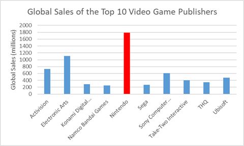
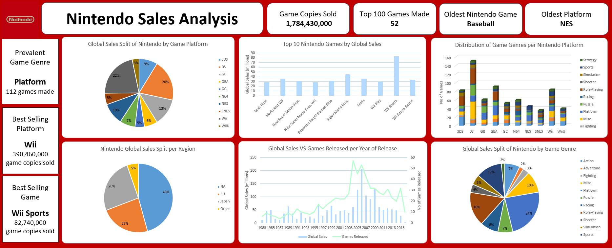

# Nintendo Video Game Sales Analysis

## Aim & Intent
While exploring the "Video Game Sales Analyze" dataset, I noticed that Nintendo was the most successful company by global sales quite comfortably.

Hence, I decided to analyse the source of Nintendo's sales in detail. The aim is to identify which games, platforms, regions and genres contributed most to the global sales.

## The Dataset
The dataset "Video Game Sales Analyze" was taken from Kaggle.
- Willian Oliveira Gibin, and GregorySmith. (2025). Video Game Sales Analyze [Data set]. Kaggle. https://doi.org/10.34740/KAGGLE/DSV/10407294

According to the creator, this dataset was created through webscraping frrom vgchartz.com using BeautifulSoup and Python.

The database covers data ranging from years 1980 to 2016. It contains a comprehensive list of video games with global sales which exceeded 100,000 copies.

Key features of the dataset are:
- Rank: Ranks video games by the number of global sales made
- Name: The title of the video game
- Platform: Specifies the platform on which the game was released
- Year: The year of release
- Genre: Categorises a game based on one of 11 genres
- Publisher: The company responsible for publishing the game
- Sales Data (measured in millions):
    - Regional sales data: Number of sales based on region (NA, EU, Japan & other)
    - Global sales data: Total number of sales across the globe

## Task List
- Data Cleaning: Go through the dataset and check for duplicates, null & inconsistent values.
- Exploratory Data Analysis: Understand the given data by using aggrigate functions & pivot tables.
- Data Visualisation: Create appropriate charts and use them to make a dashboard.
- Draw Insights: Use the dashboard to draw insights and conclusions.

## Dashboard

## Analysis Insights

### Insights
Between 1980 to 2016:
- Nintendo Wii and Nintendo DS are the best selling platforms by total sales (22% and 20%).
- Wii Sports is the best selling Nintendo game (82 million copies). Super Mario Bros for the NES is the second best selling Nintendo game (40 million copies).
- Nintendo has made 52 out of 100 top games by global game copy sales. 
    - Nintendo DS and Nintendo Wii make up 13 and 12 of these 52 games (48.1% of Nintendo's top 100 games).
- Nintendo has the top 10 games by global game copy sales (5 from Wii, 2 from NES, 2 from GB and 1 from DS).
    - Nintendo Wii has 50% of top 100 games.
- Nintendo DS has the most games (151 out of 703).
- The best selling game genres are Platform (24%), Role-Playing (16%) and Sports (12%).
    - Platform is also the most common game genre (15.9% of games made).
- Nintendo's best selling regions are NA (46%), Japan (26%) and EU (23%).
    - Nintendo's best selling region relative to its population is Japan (4 sales per capita).

### Conclusion
Nintendo's most successful platforms by sales are the Wii and DS. They also have almost 50% of Nintendo's top 100 games. However, Nintendo DS has far more games than Wii and Nintendo Wii has 50% of Nintendo's top 10 games. As such, it can be argued that the Wii has been Nintendo's most successful game platform as of 2016.

Nintendo's best selling genre are Platform games, such as the second best seller Super Mario Bros. However, it should be noted that Platform games are also Nintendo's most common game genre (16%). Nintendo has also found great success with other genres, such as Role-Playing and Sports. A good example is the Sports themed best seller Wii Sports. Nintendo doesn't seem to have an outstanding game genre as of 2016.

The NA, EU and Japan region contribute 92% of Nintendo's sales (46%, 23% and 26% respectively). In terms of raw sales, North America is Nintendo's best performing region with almost 820 million sales. However, Nintendo's best selling region relative to population is Japan (almost 4 sales per capita), showing Nintendo's dominance in the region.